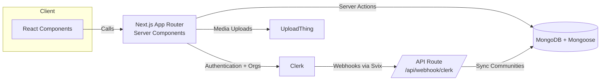

# ThreadLoom — Community Threads Platform


ThreadLoom is a full-stack discussion platform where members authenticate with Clerk, join or create communities, and publish long-form threads that branch into rich, nested conversations. Clerk organization webhooks keep MongoDB models in sync so memberships, communities, and feeds always reflect reality.

---

## Features

- **Personalized feed** – server-side rendered timeline of people and communities you follow.
- **Community workspaces** – Clerk organizations map directly to ThreadLoom communities (name, slug, logo, members).
- **Thread composer** – validated forms powered by React Hook Form + Zod for posts and replies.
- **Nested conversations** – unlimited depth via parent/child relationships and recursive rendering.
- **Discovery tools** – user + community search with debounced filtering and pagination.
- **Role-aware layout** – shared navigation that adapts to Clerk session state.

---

## Tech Stack

- **Framework** – Next.js 16 (App Router) running on React 19.
- **Language & tooling** – TypeScript 5.9 with ESLint 9 + Prettier formatting.
- **Auth & orgs** – Clerk SDK/webhooks for multi-tenant sessions.
- **Database** – MongoDB backed by Mongoose 9 models.
- **Validation & forms** – Zod 4, React Hook Form 7, and `@hookform/resolvers`.
- **UI & media** – Tailwind CSS 4, Radix primitives, tailwind-merge, and UploadThing for uploads.

---

## Quick Start

### Prerequisites

- Node.js 20+
- MongoDB Atlas (or compatible Mongo connection string)
- Clerk project (publishable + secret keys, webhook secret)
- UploadThing account for media uploads

### Installation

```bash
git clone https://github.com/<you>/threadloom.git
cd threadloom
npm install
```

### Environment variables

Create `.env.local` and supply:

```
NEXT_PUBLIC_CLERK_PUBLISHABLE_KEY=...
CLERK_SECRET_KEY=...
NEXT_CLERK_WEBHOOK_SECRET=...
MONGODB_URL=mongodb+srv://...
UPLOADTHING_SECRET=...
UPLOADTHING_APP_ID=...
```

### Development

```bash
npm run dev
# visit http://localhost:3000
```

For local webhook testing, expose the dev server (e.g., `ngrok`) and register the public URL inside Clerk pointing to `/api/webhook/clerk`.

### Production build

```bash
npm run build
npm run start
```

---

## Project Structure

```
app/                     # Next.js routes (App Router)
  (auth)/                # Onboarding + auth-only layout
  (root)/                # Auth-protected shell and feed
  api/                   # Route handlers (webhooks, uploadthing, ...)
components/              # UI primitives, cards, forms, shared widgets
lib/
  actions/               # Server actions (users, threads, communities)
  models/                # Mongoose schemas
  validations/           # Zod schemas
public/assets/           # Icons and logos
```

---

## Architecture Overview



---

## Scripts

- `npm run dev` – start the Next.js dev server.
- `npm run build` – create a production build.
- `npm run start` – serve the built app.
- `npm run lint` – run ESLint with the Next.js config.

---

## Deployment

ThreadLoom is optimized for Vercel. Configure environment variables, enable the Clerk production instance, and point the webhook to `/api/webhook/clerk` in your hosted deployment.

---

## Contributing

1. Fork the repo and create a topic branch (`git checkout -b feature/your-idea`).
2. Implement the change, add/update tests when relevant, and run `npm run lint`.
3. Open a pull request describing motivation, screenshots (for UI), and validation steps.

Questions or suggestions? Open an issue or start a thread inside ThreadLoom!
