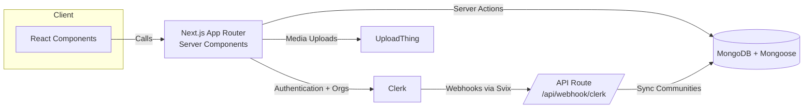

# ThreadLoom

ThreadLoom is a full-stack community discussion platform. Members authenticate with Clerk, join or create communities, and publish long-form threads that unfold into rich, nested conversations. Clerk organization webhooks stay in sync with ThreadLoom’s MongoDB models so memberships, communities, and activity streams stay consistent without manual bookkeeping.

## Features

- **Personalized feed** – server-side rendered timeline of threads from people and communities you follow.
- **Community workspaces** – Clerk organizations map directly to ThreadLoom communities (name, slug, logo, members).
- **Thread composer** – validated forms powered by React Hook Form + Zod for posts and replies.
- **Nested conversations** – unlimited depth via parent/child thread relationships and recursive rendering.
- **Discovery tools** – search for users or communities with debounced filtering and pagination.
- **Role-aware layout** – shared top/bottom/side bars with Clerk-aware links and sign-out controls.

## Tech Stack

- [Next.js 14 (App Router)](https://nextjs.org/)
- [React 18](https://react.dev/)
- [TypeScript](https://www.typescriptlang.org/)
- [Clerk](https://clerk.com/) for auth, orgs, and session management
- [MongoDB + Mongoose](https://mongoosejs.com/) for persistence
- [Tailwind CSS](https://tailwindcss.com/) for styling
- [UploadThing](https://uploadthing.com/) for media uploads
- [Zod](https://zod.dev/) + [React Hook Form](https://react-hook-form.com/) for robust form validation

## Architecture Overview



## Getting Started

1. **Install dependencies**

    ```bash
    npm install
    # or
    yarn
    ```

2. **Create environment vars**  
   Copy `.env.example` (if present) or create `.env.local` and supply the secrets below:

    ```
    NEXT_PUBLIC_CLERK_PUBLISHABLE_KEY=...
    CLERK_SECRET_KEY=...
    NEXT_CLERK_WEBHOOK_SECRET=...
    MONGODB_URL=mongodb+srv://...
    UPLOADTHING_SECRET=...
    UPLOADTHING_APP_ID=...
    ```

3. **Run the dev server**

    ```bash
    npm run dev
    ```

    Visit `http://localhost:3000`.

4. **Webhook tunnel (optional)**  
   If you test Clerk webhooks locally, expose your dev server via `ngrok` and register the public URL inside the Clerk dashboard pointing to `/api/webhook/clerk`.

## Available Scripts

- `npm run dev` – start the Next.js dev server
- `npm run build` – create a production build
- `npm run start` – serve the built app
- `npm run lint` – run ESLint with Next.js config

## Project Structure Highlights

```
app/                   # Next.js routes (App Router)
  (auth)/              # Onboarding + auth-only layout
  (root)/              # Auth-protected app shell
  api/                 # Route handlers (webhooks, uploadthing, ...)
components/
  cards/, forms/, shared/...
lib/
  actions/             # Server actions (users, threads, communities)
  models/              # Mongoose schemas
  validations/         # Zod schemas
public/assets/         # Icons + logos
```

## Deployment

ThreadLoom is optimized for [Vercel](https://vercel.com/). Set all required environment variables in your hosting provider, enable the Clerk production instance, and point the webhook URL to your deployed `/api/webhook/clerk` endpoint.

## Contributing

We welcome improvements of any size:

1. Fork the repo and create a topic branch (`git checkout -b feature/your-idea`).
2. Implement the change, add/update tests when relevant, and run `npm run lint`.
3. Open a pull request describing the motivation, screenshots (for UI), and validation steps.

Have a bigger feature in mind? Start with an issue so we can align on direction before you build.

---

Questions or suggestions? Open an issue or start a thread inside ThreadLoom!
